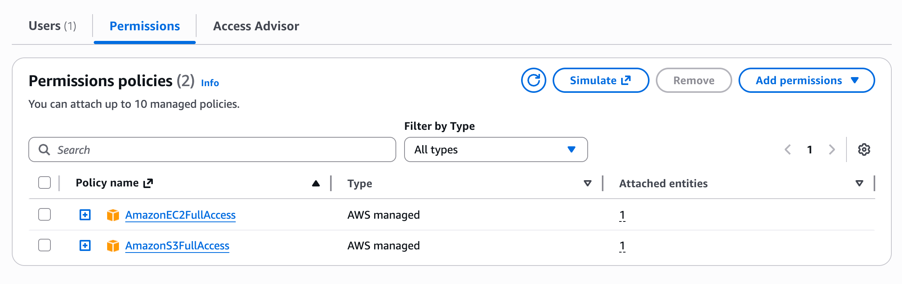
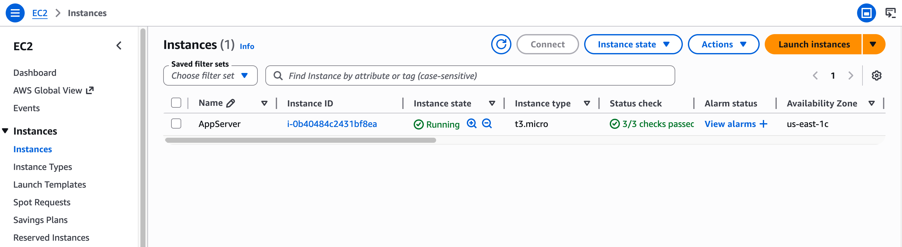
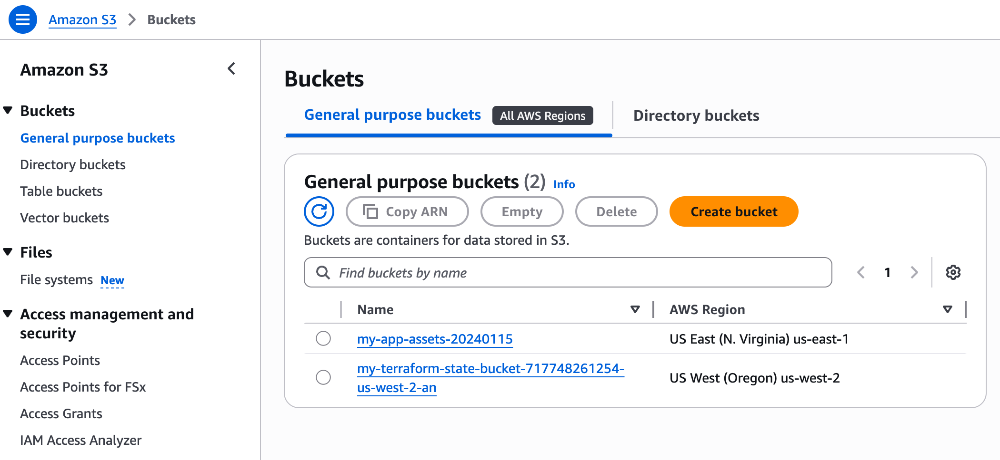
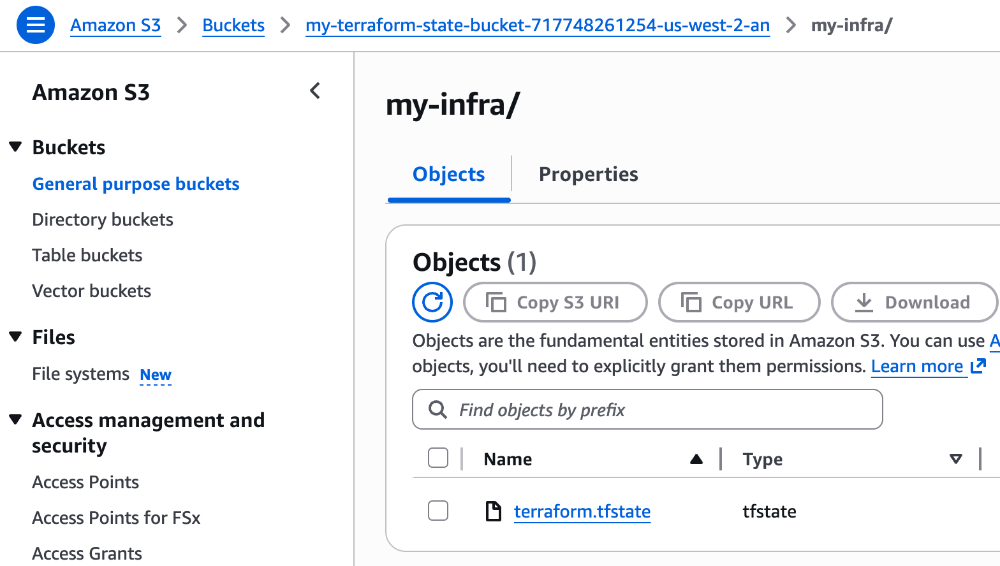

# Run the Terraform infrastructure configuration workflow

Repository for the **T4-03.04 - Examples and Real-World Workflows with Terraform** hands-on lesson.

The repo contains a standard Terraform project structure, and a GitHub Actions pipeline configured to run it.

## The scenario: what we're building?

A simple but realistic AWS setup:

- One **EC2 instance** (the application server)
- One **S3 bucket** (static assets/storage)
- Configured with **tags**, **variables**, and **outputs**
- Managed with **remote state**
- Deployed through a **CI/CD pipeline**

---

## Terraform Project Structure

```text
my-infra/
  main.tf               ← resource definitions
  variables.tf          ← input variable declarations
  outputs.tf            ← output value declarations
  terraform.tfvars      ← variable values (not committed if sensitive)
  .terraform.lock.hcl   ← provider version lock (commit this)
```

Terraform reads **all `.tf` files in the directory**. The file names aren't enforced but this convention is universal and immediately recognisable.

## Declaring inputs: `variables.tf`

```hcl
variable "region" {
  description = "AWS region to deploy into"
  type        = string
  default     = "us-east-1"
}

variable "instance_type" {
  description = "EC2 instance size"
  type        = string
  default     = "t3.micro"
}

variable "bucket_name" {
  description = "Name for the S3 bucket (must be globally unique)"
  type        = string
}
```

- Variables with `default` → optional at apply time
- `bucket_name` has no default → must be supplied (S3 names are globally unique)
- Supply values via `terraform.tfvars`, `-var` flag, or environment variable

## Resource definitions: `main.tf`

```hcl
provider "aws" {
  region = var.region
}

resource "aws_instance" "app_server" {
  ami           = "ami-0c02fb55956c7d316"
  instance_type = var.instance_type

  tags = {
    Name        = "AppServer"
    Environment = "production"
  }
}

resource "aws_s3_bucket" "app_assets" {
  bucket = var.bucket_name

  tags = {
    Name        = "AppAssets"
    Environment = "production"
  }
}
```

- `var.region`, `var.instance_type`, `var.bucket_name` → reference the declared variables
- Tags are key-value metadata → essential for cost allocation and resource management in real teams

## Surfacing values after apply: `outputs.tf`

```hcl
output "instance_public_ip" {
  description = "Public IP address of the EC2 instance"
  value       = aws_instance.app_server.public_ip
}

output "bucket_arn" {
  description = "ARN of the S3 bucket"
  value       = aws_s3_bucket.app_assets.arn
}
```

Outputs serve two purposes:

1. **Display** useful values after `terraform apply` (like the server's IP address)
2. **Pass values** between Terraform modules → one module's outputs feed another's inputs

---

## The init → plan → apply workflow in action

### Step 1: setting up the project

```bash
$ terraform init

Initializing provider plugins...
- Installing hashicorp/aws v5.31.0...
Terraform has been successfully initialized!
```

- Downloads the AWS provider plugin into `.terraform/`
- Creates `.terraform.lock.hcl` to lock provider versions
- **Commit:** `.terraform.lock.hcl` ✅
- **Don't commit:** `.terraform/` directory ❌ (add to `.gitignore`)

### Step 2: review before you apply

```bash
$ terraform plan -var='bucket_name=my-assets-20240115'

  # aws_instance.app_server will be created
  + resource "aws_instance" "app_server" {
      + ami           = "ami-0c02fb55956c7d316"
      + instance_type = "t3.micro"
    }

  # aws_s3_bucket.app_assets will be created
  + resource "aws_s3_bucket" "app_assets" {
      + bucket = "my-assets-20240115"
    }

Plan: 2 to add, 0 to change, 0 to destroy.
```

**Symbol key:**
- `+` → create  `~` → modify in place  `-` → destroy

### Step 3: making the changes

```bash
$ terraform apply -var='bucket_name=my-assets-20240115'

...

[plan output]

...

Do you want to perform these actions? (yes/no): yes

aws_s3_bucket.app_assets: Creating...        [2s]
aws_instance.app_server: Creating...         [42s]

Apply complete! Resources: 2 added, 0 changed.

Outputs:
bucket_arn         = "arn:aws:s3:::my-assets-20240115"
instance_public_ip = "54.123.45.67"
```

- Terraform asks for confirmation before proceeding
- Resources are created (they may create in parallel when there are no dependencies)
- Outputs are displayed (the IP and ARN you need immediately after provisioning)

> **Note:** in the CI/CD pipeline configured in the repository, we provide the value of `bucket_name` as an environment variable configured as a GitHub secret; you can notice the `env: TF_VAR_bucket_name: ${{ secrets.S3_BUCKET_NAME }}`; thanks to this, in that case, you can simply issue `terraform plan` and `terraform apply` commands without the `-var` flag.

---

## Remote state and the problem with local state

- Local `terraform.tfstate` → fine for solo work
- In a team
  - two engineers running `apply` simultaneously → state collision → broken infrastructure

The solution is configuring a remote state: store state in a **shared, locked backend**. Standard AWS pattern:
- **S3 bucket** → stores the state file
- **DynamoDB table** → provides state locking (prevents concurrent runs)

**S3 Backend Configuration for remote state**

```hcl
terraform {
  backend "s3" {
    bucket         = "my-terraform-state-bucket"
    key            = "my-infra/terraform.tfstate"
    region         = "us-east-1"
    dynamodb_table = "my-terraform-locks"
  }
}
```

After adding this block, run `terraform init` again and Terraform will migrate local state to S3.

> **Note:** in the repository, we directly provide the infrastructure configuration supporting remote state.

---

## Running Terraform in a GitHub Actions CI/CD pipeline (plan on PR, apply on merge)

```yaml
name: Terraform

on:
  push:       { branches: [main] }
  pull_request: { branches: [main] }

jobs:
  terraform:
    runs-on: ubuntu-latest
    steps:
      - uses: actions/checkout@v4
      - uses: hashicorp/setup-terraform@v3

      - run: terraform init

      - name: Plan (PRs only)
        run: terraform plan
        if: github.event_name == 'pull_request'

      - name: Apply (merges to main only)
        run: terraform apply -auto-approve
        if: github.ref == 'refs/heads/main' && github.event_name == 'push'
    env:
      AWS_ACCESS_KEY_ID:     ${{ secrets.AWS_ACCESS_KEY_ID }}
      AWS_SECRET_ACCESS_KEY: ${{ secrets.AWS_SECRET_ACCESS_KEY }}
```

**The Professional Team Workflow**

| Event | What runs | Who sees it |
|-------|----------|-------------|
| Pull Request opened/updated | `terraform plan` | Reviewer sees plan output in PR |
| PR merged to main | `terraform apply` | Infra changes automatically applied |

- AWS credentials stored as **GitHub Actions secrets** → never hardcoded
- Infra changes go through the **same review process as application code**
- Apply only runs after a PR is reviewed and merged → no unreviewed infra changes in production

> **Note:** this pattern is sometimes called **GitOps for infrastructure**.

---

## AWS-related configuration steps

### CI/CD testing - Step 1: you need an AWS account

- Create your AWS account
- Sign in and access to the AWS console

### CI/CD testing - Step 2: you need an identity and proper permissions in place

- Once you signed in to AWS, go to the **Identity and Access Management (IAM) console**, then navigate to IAM (search "IAM" in the top search bar)

- Go to **User groups**, in the left sidebar; create a new **user group** (i.e., a collection of IAM users used to specify permissions for a collection of users)
  - In our case, the user group will need the proper permission policies to access and handle EC2 instances and S3 buckets
  - E.g., I created a user group to contain IAM users to be used for GitHub Actions tests in general, and assigned to the group two permissions (i.e., AmazonEC2FullAccess, AmazonS3FullAccess)



- Go to **Users**, in the left sidebar; create a new **IAM user** (i.e., an entity that you create in AWS to represent the person or application that uses it to interact with AWS) and add it to the previously created group
  - In our case, we want to use it for this GitHub Actions pipeline, that will run Terraform, which in turn will interact with AWS infrastructure layer APIs
  - E.g., I created a user to give access to this specific CI/CD pipeline

- Add the IAM user to the group you created; since the user needs appropriate permissions, at minimum, policies for EC2 and S3 (e.g., AmazonEC2FullAccess and AmazonS3FullAccess), we can attach these under the user's **Permissions** tab → **Add permissions** (_bad practice_), or add the user to the group we previously prepared and keep permissions attached to the group (_good practice_); you can add the user to the group from the user's **Group** tab → **Add user to groups**
  - For a real production setup we'd use a more restrictive custom policy, but for a demo these managed policies work fine

- Create an access key in AWS IAM, for the user you just created; to create the access key, you can click on the user's **Security credentials** tab, scroll to **Access keys**, click **Create access key**
  - Select use case, in our case, choose **Third-party service** (since it's for GitHub Actions), acknowledge the warning, and click **Next**
  - Copy both values immediately: you have an **Access key ID** (starts with AKIA... of ~20 characters), and a **Secret access key** (longer string of ~40 characters); you can only see the secret key once, so if you lose it, you must create a new key pair

### CI/CD testing - Step 3: you need to configure your IAM user credentials as GitHub Secrets to be accessed from the pipeline

- Store the IAM user credential values into GitHub Secrets:
  - AWS_ACCESS_KEY_ID → the AKIA... value
  - AWS_SECRET_ACCESS_KEY → the longer secret value

- Go to the **Amazon S3** console → **Buckets** → **General purpose buckets** and click on **Create bucket** to create the S3 bucket for the Terraform state; this must be done before Terraform can use it as backend; the S3 state bucket is often created separately, either manually or in a "bootstrap" Terraform project, before the main project can use it; we will create it manually in the AWS console, and when we run the pipeline, Terraform `init` will find the bucket and store the state there
  - **Bucket name:** my-terraform-state-bucket (or pick any unique name and update `main.tf` to match)
  - **Region:** must match the region in your backend block
  - Leave defaults (Block Public Access enabled, etc.)
  - Click **Create bucket**

> As a general rule: if it grants access, it's a secret; if it's just a name or configuration value, it belongs in code where it can be reviewed and version-controlled. E.g., the state bucket name is not sensitive, it's just an identifier, and knowing a bucket name alone doesn't grant access, IAM permissions control that, so it's fine to have the state bucket name in code.
>
> **What should be in secrets:**
>
> - AWS access keys (credentials)
> - API tokens
> - Passwords
>
> **What's fine in code:**
>
> - Bucket names
> - Region names
> - Resource configurations
> - Backend configuration

### Local testing

To configure AWS credentials locally, you need to either:

- Set environment variables for the terminal session

```bash
export AWS_ACCESS_KEY_ID="your-key-id"
export AWS_SECRET_ACCESS_KEY="your-secret-key"
```

- Or configure the AWS CLI (persists across sessions);
  
```bash
aws configure
```

this will prompt for the access key, secret key, and default region.

> In GitHub Actions, the credentials come from secrets automatically. Locally, you need to provide them through one of these methods.

## AWS infrastructure resources after deployment

### One EC2 instance is running (the one for the application server)



### One S3 bucket has been created (the one for static assets/storage)

- Notice the bucket name, it is exactly the one passed to Terraform `apply`



> The second S3 bucket showed here is the one created to configure Terraform remote state.

### The content of the Terraform remote state S3 bucket


